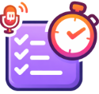

<div align="center">

  

  <h1>OBS Todo</h1>
  
  <p>
    <strong>A browser-based timed task dashboard and dynamic overlay for OBS and Streamlabs.</strong>
  </p>

  <p>
    <a href="https://obs-todo.com/">Live Application</a> • 
    <a href="https://docs.obs-todo.com/">Documentation</a> • 
    <a href="https://docs.obs-todo.com/">Integration Guide</a>
  </p>

  <p>
    
    
    
  </p>

</div>

---

## Overview

**OBS Todo** is a task-list overlay built for Pomodoro and co-working (study/work-with-me) streamers. It runs as a browser-source widget and supports both cloud sync and local guest mode. The tool includes a Pomodoro timer, individually timed tasks, a completed-task history with stats, and an auto-scrolling or looping task list to keep items readable and dynamic during streams.

## Key Features

### Display & Overlay Control
* **Browser Source Native:** Runs entirely within the browser source of streaming software.
* **Minimal View:** A toggleable mode that hides UI elements (headers, settings) to leave only the task list visible.
* **Privacy Control:** A "Hide User Status" lock icon instantly masks email addresses and usernames.

### Dynamic Flow Modes
The application includes specialized scrolling behaviors to keep content visible on stream:

| Mode | Behavior | Best Use Case |
| :--- | :--- | :--- |
| **Loop Active** | Continuously scrolls active tasks. | Long task lists. |
| **Loop All** | Scrolls all tasks (active & completed). | End-of-stream summaries. |
| **Auto-scroll** | Gentle bounce effect. | Short lists (1-3 items). |
| **Pinned + Loop** | Keeps top task fixed; rotates others. | highlighting a main objective. |

### Productivity & Reporting
* **Pomodoro Timer:** Built-in interval timer (25/5 and 50/10 cycles) with audio alerts.
* **Task Timers:** Individual "Play" buttons for every task to track specific time expenditure.
* **Analytics:** Tracks daily focus time, task completion streaks, and time distribution via keyword tags.
* **Offline Logging:** Capability to manually log tasks completed off-stream.

---

## Integration Guide

### OBS / Streamlabs Setup

1.  Open OBS Studio or Streamlabs.
2.  Add a new **Browser** source.
3.  Set the URL to: `https://obs-todo.com/`
4.  Set the dimensions to **Width: 800** and **Height: 800**.
5.  **Crucial Step:** Paste the following into the **Custom CSS** field to ensure transparency:

```css
body { 
    background-color: rgba(0, 0, 0, 0); 
    margin: 0px auto; 
    overflow: hidden; 
    overflow-y: auto !important;
} 
body::-webkit-scrollbar { 
    display: none; 
}

```
## Contributing
### Contributions are welcome! This project uses:

* Vanilla JS 
* Chart.js for analytics
* Firebase SDK for backend
  
1. Fork the Project

2. Create your Feature Branch (git checkout -b feature/AmazingFeature)

3. Commit your Changes (git commit -m 'Add some AmazingFeature')

4. Push to the Branch (git push origin feature/AmazingFeature)

5. Open a Pull Request

## 📄 License
This project is free to use.

### Author:Construct.exe / yassfix
-----------------------------------------------------------
Made with 💜 for the streaming community.

